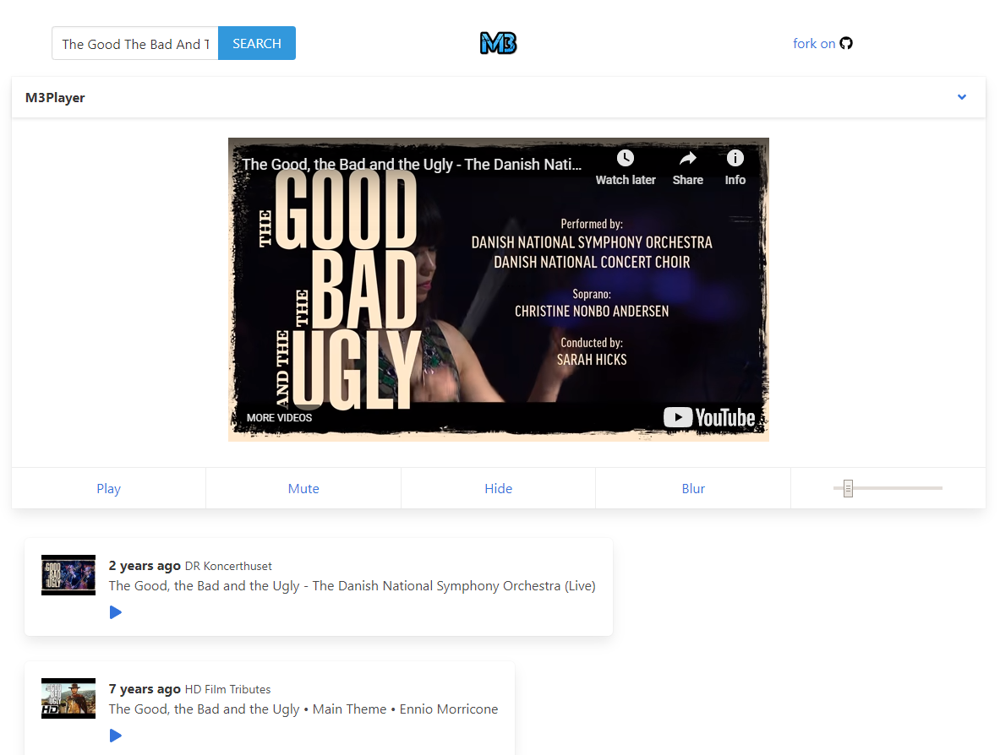

# 3.0.0

- [x] Completly redesigned structure

# 2.1.0

- [x] react-router-dom (Single page view added)

# 2.0.0

- [x] Bug fixes
- [x] Code structure upgrade and better code formatting
- [x] Removed react-router-dom (Single page view removed)
- [x] Added Play/Pause button on Single Item
- [x] Better notification on error
- [x] UI tweak
- [x] Build version published on firebase

# 1.0.0

- [x] YouTube player on a different view
- [x] YouTube data api v3
- [x] Build version published as github page
- [x] Packages
  - [x] create-react-app
  - [x] bulma
  - [x] react-router-dom
  - [x] moment
  - [x] redux, react-redux
  - [x] redux-thunk
  - [x] axios

YouTube implemented for me using ReactJs, React Router Dom, Redux, Redux-thunk and YouTube API v3 [https://m3tube.firebaseapp.com/](https://m3tube.firebaseapp.com/).

I use this script to listen music when I do not want other to know by looking at my computer screen which website I am browsing. This app has some known bug and most probably I will not fix it because it has everything I need and I do not perform action that will produce bug.

btw! I tried to use a lot of popular package like React Router Dom V4, Redux, Redux-thunk, MomentJS etc.

If you want to run this script, just run `npm install` and rename `/src/config/settings.sample.js` file to `/src/config/settings.js` and update google api key. API key has to be YouTube data api v3 enabled.

## Available Scripts

In the project directory, you can run:

### `npm start`

Runs the app in the development mode. 
Open [http://localhost:3000](http://localhost:3000) to view it in the browser.
