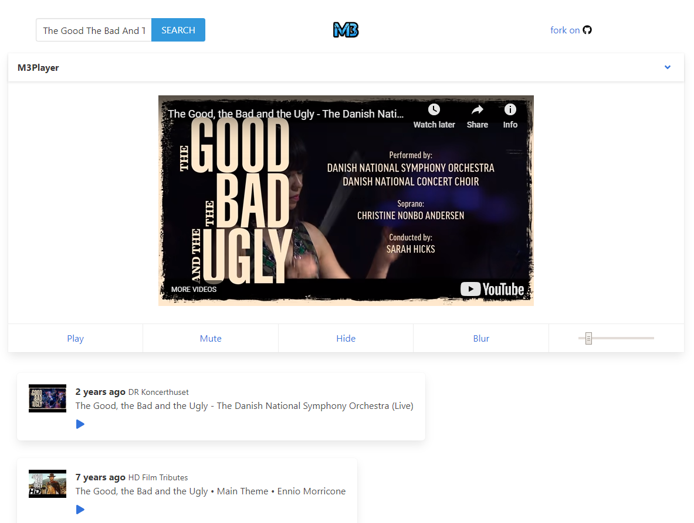

# m3tube

A minimal YouTube-powered music player built with **React**, **Redux**, and the **YouTube Data API v3**. Search, play, and keep listening in the background — with a "cloud" blur mode so nobody at your desk knows what you're watching.

Live: [m3tube.web.app](https://m3tube.web.app/)



## Features

- Search YouTube videos and paginate through results
- Play / pause / mute / volume control
- Blur or hide the player (audio keeps playing)
- Persistent floating player that survives navigation
- Deep-link to a video via `/:videoId`

## Stack

- React 16 + Create React App 5
- Redux + Redux Thunk
- React Router v5
- Bulma for styling
- Axios for HTTP
- Firebase Hosting for deploys

## Requirements

- Node.js **>= 16**
- A Google API key with the **YouTube Data API v3** enabled — [create one](https://console.cloud.google.com/apis/library/youtube.googleapis.com)

## Setup

```bash
git clone https://github.com/alaminio/m3tube.git
cd m3tube
npm install
cp src/config/settings.sample.js src/config/settings.js
```

Then open `src/config/settings.js` and replace `google-api-key` with your key.

## Scripts

```bash
npm start      # dev server at http://localhost:3000
npm run build  # production build in ./build
npm test       # run tests
npm run deploy # build + firebase deploy (requires firebase login)
```

## Deploy to Firebase

```bash
npm run f-login   # one-time login
npm run deploy
```

The `.firebaserc` and `firebase.json` in this repo target the `m3tube` Firebase project. Change them to point at your own.

## Project structure

```
src/
├── App.jsx
├── index.js
├── components/    reusable UI (player, item, header, etc.)
├── pages/         route-level views (homepage, singlepage)
├── redux/         store, actions, reducers
├── config/        API key, YouTube axios instance, moment locale
└── styles/        global styles
```

## License

MIT
